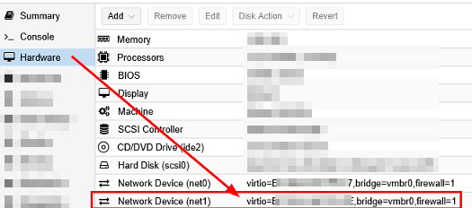
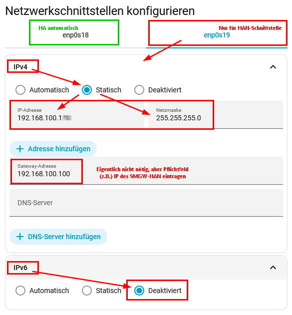

# Netzwerk-Einrichtung: Home Assistant und SMGW verbinden

Das PPC Smart Meter Gateway ist in der Regel fix auf eine IP (z.B. `192.168.100.100` oder `192.168.1.200`) konfiguriert und lässt sich in der Regel nicht ändern. Home Assistant läuft typischerweise im Router-Netzwerk auf einer lokalen IP-Adresse wie z.B. `192.168.2.12`. Da diese beiden Netzbereiche nicht direkt miteinander kommunizieren, ist die eleganteste und schnellste Lösung, dem "Home Assistant"-Server eine zweite IP-Adresse aus dem IP-Bereich (z.B. `192.168.100.x` bzw. `192.168.1.x`) des SMGW zu geben. Ich gehe im folgenden einfach mal von der IP `192.168.100.100` aus.

> [!NOTE]
> Die Netzwerk-Einstellungen unten gibt es nur bei **Home Assistant OS** und **Supervised**. Bei **HA Container** (Docker, z. B. im Container Manager eines NAS) und **HA Core** fehlen sie; dort richtest Du die zusätzliche IP-Adresse auf dem Host-System ein.

## Welche Variante passt?

- **[Variante A](#variante-a) – zweite IP-Adresse auf der vorhandenen Netzwerkschnittstelle:** funktioniert immer, auch wenn der Rechner nur einen Netzwerkanschluss hat (z. B. ein Raspberry Pi). Die Schnittstelle muss dafür auf _Statisch_ umgestellt werden.
- **[Variante B](#variante-b) – eigene Netzwerkschnittstelle für das SMGW:** empfohlen, wenn Home Assistant in einer virtuellen Maschine läuft (z. B. unter Proxmox) oder der Rechner einen zweiten Netzwerkanschluss hat. Die bisherige Schnittstelle bleibt dabei auf _Automatisch_: Man kann sich die Verbindung zu HA nicht versehentlich wegkonfigurieren, und nach einem Router- oder Adresswechsel (z. B. beim Umstieg von DSL auf Glasfaser) bekommt HA seine Adresse weiterhin automatisch.

## Variante A: Zweite IP-Adresse auf der vorhandenen Schnittstelle

1. _**Einstellungen → System → Netzwerk**_
2. Dort im Abschnitt _Netzwerkschnittstellen konfigurieren_ den Bereich _IPv4_ aufklappen
3. _Statisch_ selektieren (falls nicht sowieso schon aktiv. Das ist nötig, weil _Automatisch_ (d.h. DHCP) und zwei IP-Adressen sich in HA gegenseitig ausschließen). Notiere Dir vorher die aktuelle IP-Adresse.
4. _+ Adresse hinzufügen_ anklicken
5. Im neuen Feld mit 0.0.0.0 die neue _IP-Adresse_ eingeben, z.B. `192.168.100.12`
   - Die letzte Zahl (hier `12`) ist frei wählbar, solange diese IP nicht bereits im Bereich `192.168.100.x` vergeben ist. Normalerweise sollte der aber außer der IP `192.168.100.100` vom SMGW leer sein.
   - Achtung! Gut aufpassen, dass man nicht das falsche _IP-Adresse_-Feld ausfüllt und sich damit den eigenen Ast absägt, auf dem man sitzt.
6. _Netzmaske_ `255.255.255.0` prüfen (sollte automatisch korrekt sein)
7. _**Speichern**_

**Am Ende sollte alles so aussehen, wie in diesem Screenshot:**

**Und das war es auch schon.** Jetzt kann der "Home Assistant"-Server direkt mit dem SMGW reden. Ohne komplizierte Routen, vLANs oder die Umstellung des gesamten privaten Netzwerks. 
Als nächstes muss nur noch die SMGW-Integration gestartet werden und diese sollte sich dann erfolgreich mit dem SMGW verbinden können. 

Weil die Schnittstelle jetzt auf _Statisch_ steht, bekommt HA seine Adresse nicht mehr vom Router. Wechselst Du später Router oder Adressbereich, musst Du die Adresse hier von Hand anpassen, sonst ist HA nicht mehr erreichbar. Wer das vermeiden will, nimmt [Variante B](#variante-b).

## Variante B: Eigene Netzwerkschnittstelle für das SMGW

_Idee und Screenshot: [@ptar](https://github.com/ptar), siehe [Discussion #71](https://github.com/TRON4R/ha-ppc-smgw-han/discussions/71). Danke!_

Beispiel Proxmox:

1. In Proxmox die VM auswählen → _Hardware_ → _Hinzufügen_ → _Netzwerkgerät_. Als _Bridge_ dieselbe wie bei der vorhandenen Netzwerkkarte wählen (meist `vmbr0`), als _Modell_ _VirtIO_. Danach erscheint in der Hardware-Liste ein zweites Netzwerkgerät (`net1`):

   
2. Die VM neu starten.
3. In Home Assistant _**Einstellungen → System → Netzwerk**_ öffnen. Unter _Netzwerkschnittstellen konfigurieren_ gibt es jetzt zwei Reiter, z. B. `enp0s18` und `enp0s19`. Die bisherige Schnittstelle erkennst Du an ihrer IP-Adresse (vorher notieren), die neue ist meist die mit der höheren Nummer.
4. Nur bei der **neuen** Schnittstelle:
   - _IPv4_: _Statisch_ wählen, als _IP-Adresse_ z. B. `192.168.100.12` und als _Netzmaske_ `255.255.255.0` eintragen.
   - _Gateway-Adresse_: die Adresse des SMGW eintragen, also `192.168.100.100`. Für die Verbindung zum SMGW braucht HA kein Gateway, das Feld ist aber ein Pflichtfeld. Bleibt es leer, meldet HA beim Speichern „Ändern der Netzwerkeinstellungen fehlgeschlagen" mit dem Zusatz `expected IPv4Address for dictionary value @ data['ipv4']['gateway']. Got None`.
   - _DNS-Server_: leer lassen.
   - _IPv6_: _Deaktiviert_ wählen, im Netz des SMGW gibt es kein IPv6.
   - _**Speichern**_
5. Die bisherige Schnittstelle nicht anfassen, sie bleibt auf _Automatisch_.
6. Kurz prüfen, ob HA weiterhin ins Internet kommt, z. B. ob HACS seine Liste lädt. Das Gateway der neuen Schnittstelle ist ein zweiter Weg nach draußen; normalerweise behält die bisherige Schnittstelle den Vorrang. Falls nicht, Variante A verwenden.

**So sieht die neue Schnittstelle am Ende aus:**

Bei anderen Hypervisoren (z. B. Synology VMM, QNAP Virtualization Station, VirtualBox) funktioniert es genauso: der VM eine weitere Netzwerkkarte hinzufügen, die VM neu starten und ab Schritt 3 weitermachen. Hat der Rechner einen zweiten physischen Netzwerkanschluss, verbindest Du diesen mit dem Switch und machst ebenfalls ab Schritt 3 weiter.

## Hinweise

- Natürlich muss der HAN-Port des SMGW per LAN-Kabel mit demselben Switch verbunden sein, mit dem auch der Home Assistant-Server verbunden ist. Sollte der Home Assistant in einer Virtual Machine z.B. auf einem NAS (z.B. Synology oder QNAP) laufen, so spielt die IP bzw. IP-Range des NAS selbst (also des Host-Gerätes) keine Rolle. Wichtig ist nur, dass die Home Assistant-Instanz (wie oben beschrieben) diese zusätzliche IP in der IP-Range des SMGW aktiv hat. 
- Nach dieser Änderung ist ggf. ein Neustart von Home Assistant erforderlich, damit die Änderung wirksam wird.
- Je nach Setup (VM, Host-System) kann auch ein Reboot der Virtual Machine oder des gesamten Host-Rechners nötig sein, damit die neue IP aktiv wird.
- Die neue IP muss **nicht** als SMGW-URL eingetragen werden — die bleibt weiterhin `https://192.168.100.100/cgi-bin/hanservice.cgi`. Die neue IP sorgt nur dafür, dass Home Assistant die `192.168.100.100` überhaupt ohne irgendwelche komplizierten Routing-Tabellen erreichen kann.
- Wenn Du das SMGW auch von Deinem Rechner aus per Browser erreichen können willst, musst Du diesem ebenfalls eine zweite IP aus dem Bereich `192.168.100.x` geben. Diese muss dann entsprechend am Ende eine andere Zahl als `.100` (schon vom SMGW belegt) und der oben eingetragenen IP sein (schon vom Home Assistant Server belegt). Wie man das genau unter Windows, macOS oder Linux macht, kann Dir jede gute KI (z.B. ChatGPT, Claude oder Gemini) Schritt für Schritt erklären.
- Alle meine Versuche, die SMGW-Oberfläche innerhalb von Home Assistant z.B. in einer eigenen Kachel anzuzeigen (um nicht meinem PC auch noch eine zweite IP-Adresse geben zu müssen), sind leider fehlgeschlagen. Das BSI hat das SMGW absolut **zugenagelt**. Irgendjemand sagte mal treffend: die SMGW werden sich sogar einem Angriff vom Mars erfolgreich widersetzen.  Weder ist die Einbindung als iFrame erlaubt, noch hilft es, z.B. per Nginx Proxy die limitierenden Header-Einträge (`X-FRAME-OPTIONS: DENY`) rauszufiltern. Denn am Ende scheitert man dann an Session-Cookies und anderen Späßchen und fliegt nach der erfolgreichen Anmeldung sofort wieder aus der Weboberfläche raus. Selbst auf einen simplen `ping` reagiert das SMGW nicht. Wer hier eine Lösung findet, die in HA nachhaltig funktioniert, **bitte melden!**
